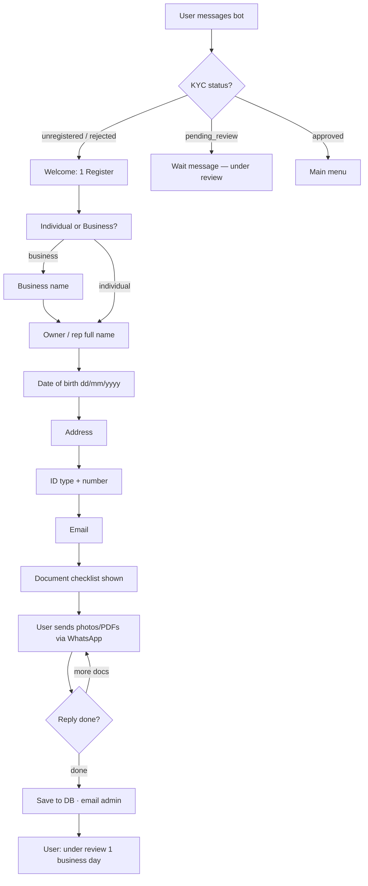
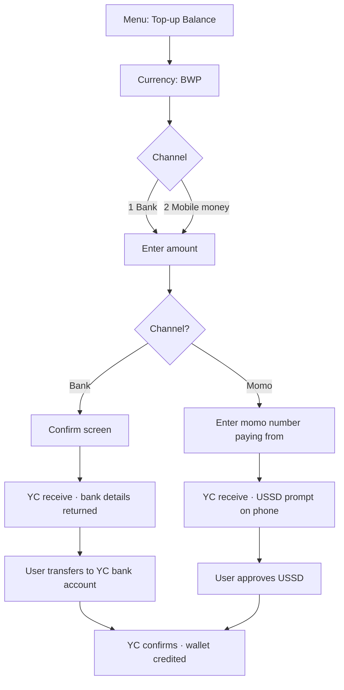
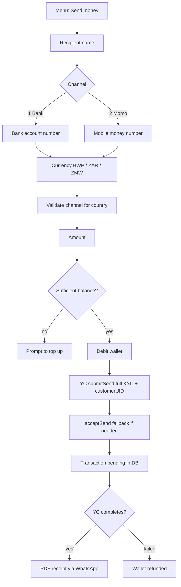
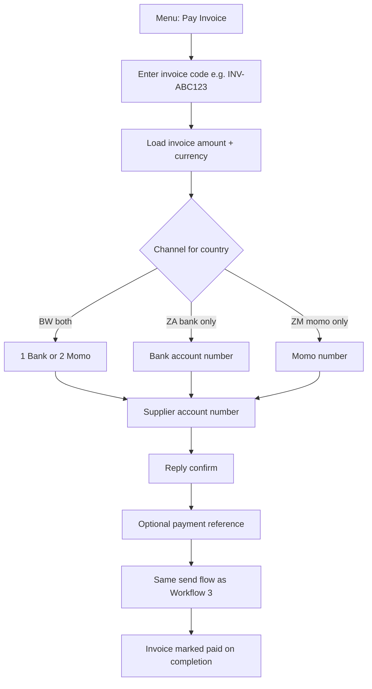

# PayLink — WhatsApp Cross-Border Payments Bot

PayLink is a WhatsApp bot that lets individuals and businesses register, verify their identity, fund an internal wallet, and send money or pay invoices to bank accounts and mobile money wallets across **Botswana (BWP)**, **South Africa (ZAR)**, and **Zambia (ZMW)**.

Built with **Twilio WhatsApp** + **Node.js on Vercel** + **Supabase Postgres** + **Yellow Card** (fiat settlement).

---

## What the bot does

| Capability | Individuals | Businesses |
|------------|:-----------:|:----------:|
| Register (KYC/KYB) with document upload | ✅ | ✅ |
| Manual admin approval via email | ✅ | ✅ |
| Internal multi-currency wallet (BWP, ZAR, ZMW) | ✅ | ✅ |
| Top-up via **bank transfer** | BW, ZA | BW, ZA |
| Top-up via **mobile money** | BW, ZM | BW, ZM |
| Send money to bank or mobile wallet | ✅ | ✅ |
| Pay supplier invoice | — | ✅ |
| Create invoice (share code with customer) | — | ✅ |
| Check balance | ✅ | ✅ |
| Transaction history (last 5) | ✅ | ✅ |
| Status lookup (reference / invoice code) | — | ✅ |
| PDF remittance receipt on completed sends | ✅ | ✅ |

---

## Architecture

```
Customer WhatsApp
      │
      ▼
Twilio WhatsApp API  ──►  /api/whatsapp.js
                                │
                                ▼
                        lib/conversation.js   (state machine / menus)
                                │
              ┌─────────────────┼─────────────────┐
              ▼                 ▼                 ▼
         Supabase DB      Yellow Card API    Resend (KYC email)
    users · wallets ·     receive (top-up)         │
    sessions · txns ·     send (payout)            ▼
    invoices · kyc         webhooks          /api/admin-kyc-*
              │                 │
              │                 ▼
              │     /api/yellowcard-webhook.js
              │                 │
              └────────► Twilio WhatsApp reply + PDF receipt
```

### API endpoints

| Endpoint | Purpose |
|----------|---------|
| `POST /api/whatsapp` | Incoming Twilio messages (text + media) |
| `POST /api/yellowcard-webhook` | Yellow Card payment status events |
| `GET /api/poll-topups` | Cron poller for all pending transactions |
| `GET /api/receipt?id=` | PDF remittance receipt (completed sends only) |
| `GET /api/admin-kyc-decision` | Approve or reject registration (email link) |
| `GET/POST /api/admin-kyc-request-info` | Request more KYC documents (email link) |

---

## Two balances (important)

The bot uses **two separate balances**. They are not the same thing.

| Balance | Where | What it is |
|---------|-------|------------|
| **User wallet** | Supabase `wallets` table | What the customer sees in WhatsApp. Debited on send; credited on top-up. |
| **YC Treasury** | Yellow Card dashboard | Stablecoin balance (USD) that Yellow Card uses to settle fiat payouts. |

- **Top-up (menu)** → calls Yellow Card **receive** API → credits the **user wallet** when payment completes.
- **Send / Pay invoice** → debits the **user wallet** → calls Yellow Card **send** API → YC pays out from **Treasury**.

You must fund the YC Treasury separately (stablecoin deposit in the Treasury Portal). See [YC Balance Top up docs](https://docs.yellowcard.engineering/docs/settlement-api.md).

---

## Country & channel coverage

Yellow Card currently supports these corridors for this bot:

| Country | Currency | Top-up bank | Top-up momo | Send bank | Send momo |
|---------|----------|:-----------:|:-----------:|:---------:|:---------:|
| Botswana | BWP | ✅ | ✅ (MyZaka, etc.) | ✅ | ✅ |
| South Africa | ZAR | ✅ | ❌ | ✅ | ❌ |
| Zambia | ZMW | ❌ | ✅ | ❌ | ✅ |

**Not supported yet:** Namibia (NAD), Zimbabwe (ZWL) — excluded until Yellow Card lists them on their [Africa coverage page](https://docs.yellowcard.engineering/docs/africa).

**Transaction limits:** minimum **10**, maximum **100,000** (local currency units) per transaction.

**Card top-up:** not available via Yellow Card’s direct API. Only bank and mobile money are supported.

---

## Menus

### Welcome (unregistered / rejected users)

```
Welcome to PayLink 👋
1️⃣ Register
2️⃣ Help
```

### Individual menu (after KYC approval)

```
1️⃣ Send money to bank or mobile wallet
2️⃣ Top-up Balance
3️⃣ Check Balance
4️⃣ Transaction History
```

### Business menu (after KYC approval)

```
1️⃣ Pay Invoice (pay a supplier)
2️⃣ Send money to bank or mobile wallet
3️⃣ Top-up Balance
4️⃣ Check Balance
5️⃣ Check invoice / transaction status
6️⃣ Transaction History
7️⃣ Create Invoice
```

Reply **hi**, **hello**, **menu**, or **start** anytime to return to the main menu.

---

## Workflow 1 — Customer registration (Individual & Business)

Both account types follow the same steps after choosing account type. Businesses collect one extra field (business name) and require more documents.



### Individual — documents required

1. Government-issued photo ID (National ID, Passport, or Driver's Licence)
2. Proof of address (utility bill or bank statement, within 3 months)
3. Selfie holding the ID document

### Business — documents required (KYB)

1. Certificate of Incorporation / Business Registration
2. Company tax registration certificate
3. Proof of business address (within 3 months)
4. Government-issued photo ID of authorised representative
5. Proof of address of authorised representative (within 3 months)
6. Selfie of representative holding their ID
7. Latest audited financial statements or management accounts (if available)

### What happens after submission

1. User record saved with `kyc_status = pending_review`
2. Documents stored in `kyc_submissions` (Twilio media URLs)
3. Admin receives email (Resend) with attachments and three actions:
   - **Approve** → `kyc_status = approved`, wallets created (BWP, ZAR, ZMW at 0), WhatsApp welcome message
   - **Reject** → `kyc_status = rejected`, user notified
   - **Request More Info** → admin adds optional note, user gets WhatsApp checklist to resubmit

Until approved, only the welcome screen and help text are available — no payments.

---

## Workflow 2 — Top-up balance (fund user wallet)

Top-up uses Yellow Card’s **receive** API. When YC confirms payment, the user’s **internal wallet** is credited.

### Top-up — Botswana (BWP) — bank or momo



### Top-up — South Africa (ZAR) — bank only

1. Choose **ZAR** (bank is the only channel — no choice step)
2. Enter amount → **confirm**
3. Bot returns Yellow Card bank details + payment reference (`receive.id`)
4. User makes bank transfer with that reference
5. Wallet credited when YC marks receive complete

### Top-up — Zambia (ZMW) — mobile money only

1. Choose **ZMW** (momo is the only channel)
2. Enter amount
3. Enter mobile money number (normalised to `+260…`)
4. USSD prompt sent to that number — user must approve
5. Wallet credited on completion

### Top-up settlement paths

The wallet is credited through any of these (idempotent — only once):

1. **Yellow Card webhook** (`RECEIVE.COMPLETE`) — primary
2. **Per-message poll** — `settlePending()` runs at the start of every incoming message
3. **Cron poller** — `GET /api/poll-topups?secret=…` every 2–5 minutes
4. **Immediate poll** — right after `submitReceive` returns

User receives WhatsApp: `✅ Top-up of X CURRENCY confirmed! New balance: Y`

---

## Workflow 3 — Send money (Individual & Business)

Send money debits the user wallet and pays out to a recipient via Yellow Card **send** API.



### Step-by-step (send money)

| Step | User input | Bot action |
|------|------------|------------|
| 1 | Recipient name | Saves to session |
| 2 | `1` bank or `2` momo | Sets `channelType` |
| 3 | Account / momo number | Momo normalised to E.164 later |
| 4 | Currency (`BWP`, `ZAR`, `ZMW`) | Validates channel allowed for country |
| 5 | Amount | Checks wallet balance ≥ amount |
| 6 | — | Debits wallet, calls `submitSend` |
| 7 | — | User told payout is processing; receipt follows |

### Yellow Card payload (sends)

For BWP / ZAR / ZMW, **full sender KYC** is always sent (Tier 0 reduced KYC does not apply):

- `name`, `country`, `phone`, `address`, `dob`, `email`, `idNumber`, `idType`
- `customerUID` (user’s phone digits)
- `reason`: `other` (send) or `bills` (invoice payment)
- `destination.country`, `networkId` (auto-selected from active YC networks)
- `forceAccept: true` + `acceptSend` fallback if still `created`/`pending`

### Send settlement & receipt

When Yellow Card marks the send **complete**:

1. Transaction status → `completed`
2. PDF receipt generated at `/api/receipt?id=<txn_uuid>`
3. WhatsApp message + PDF attachment sent to payer
4. `receipt_sent` flag set (prevents duplicates)

If send **fails** → wallet amount refunded, user notified.

---

## Workflow 4 — Pay invoice (Business only)

Two ways to pay a supplier:

### A) Pay by invoice code



### B) Manual entry (skip invoice code)

1. Pay Invoice → reply **skip**
2. Enter supplier name → channel → account → currency → amount → reference
3. Same payout flow as send money (`type = invoice_payment`)

---

## Workflow 5 — Create invoice (Business only)

| Step | Input |
|------|-------|
| 1 | Currency (`BWP`, `ZAR`, `ZMW`) |
| 2 | Amount |
| 3 | Description |

Bot returns an invoice code (e.g. `INV-A1B2C3`) to share with the customer. The customer (or another business) pays via **Pay Invoice** using that code.

Invoices stay `pending` until a linked `invoice_payment` transaction completes.

---

## Workflow 6 — Check balance, history & status

### Check balance (both account types)

- Polls pending transactions first (`settlePending`)
- Returns all currency balances, e.g. `BWP: 5000.00`

### Transaction history (both)

- Last **5** transactions with type, amount, status, recipient

### Status lookup (business only)

Accepts:

- Yellow Card reference (UUID from payout/top-up)
- Internal payment reference
- Invoice code (`INV-…`)

Polls Yellow Card before displaying status. Pending sends may complete and trigger receipt delivery during lookup.

---

## Sandbox testing

Use Yellow Card sandbox: `YELLOWCARD_BASE_URL=https://sandbox.api.yellowcard.io`

Fund the **YC Treasury** in the sandbox dashboard (stablecoin top-up address). Sandbox accounts often ship with pre-funded balance.

### Test account numbers

Per [YC Sandbox Testing](https://docs.yellowcard.engineering/docs/sandbox-testing-api.md):

| Type | Success | Failure |
|------|---------|---------|
| Bank account | `1111111111` | `0000000000` |
| Mobile money | `+{countryCode}1111111111` | `+{countryCode}0000000000` |

**Botswana momo success:** `+2671111111111`  
**South Africa bank success:** `1111111111`  
**Zambia momo success:** `+2601111111111`

Real phone numbers in sandbox may stay **pending** indefinitely.

---

## Setup

### 1. Supabase

1. Create a project at https://app.supabase.com
2. Run `db/schema.sql` in the SQL Editor (safe to re-run)
3. Copy **Project URL** → `SUPABASE_URL`
4. Copy **service_role** key → `SUPABASE_SERVICE_ROLE_KEY`

### 2. Twilio WhatsApp

1. Create account at https://console.twilio.com
2. Enable WhatsApp Sandbox (testing) or apply for a production sender
3. Set **When a message comes in** webhook to:
   `https://<your-app>.vercel.app/api/whatsapp` (HTTP POST)
4. Copy Account SID, Auth Token, WhatsApp number → env vars

### 3. Yellow Card

1. Get sandbox credentials from https://docs.yellowcard.engineering
2. Set `YELLOWCARD_API_KEY`, `YELLOWCARD_SECRET_KEY`, `YELLOWCARD_BASE_URL`
3. Register webhook: `https://<your-app>.vercel.app/api/yellowcard-webhook`
   - Subscribe to: `RECEIVE.COMPLETE`, `RECEIVE.FAILED`, `SEND.COMPLETE`, `SEND.FAILED`
4. Fund Treasury balance in the YC dashboard before testing sends

### 4. Resend (KYC emails)

- `RESEND_API_KEY` from https://resend.com/api-keys
- `RESEND_FROM_EMAIL` — `PayLink <onboarding@resend.dev>` works for testing
- `ADMIN_EMAIL` — where review emails are sent

### 5. Deploy to Vercel

1. Push to GitHub and import in Vercel
2. Add all variables from `.env.example`
3. Set `PUBLIC_APP_URL` to your Vercel URL (no trailing slash) and redeploy
4. Configure Twilio and YC webhooks with the live URL

### 6. Cron poller (recommended)

Hit every 2–5 minutes:

```
https://<your-app>.vercel.app/api/poll-topups?secret=<CRON_SECRET>
```

Free options: [cron-job.org](https://cron-job.org). Vercel Hobby cron is limited to once/day.

---

## Environment variables

See `.env.example` for the full list:

| Variable | Purpose |
|----------|---------|
| `TWILIO_ACCOUNT_SID` / `TWILIO_AUTH_TOKEN` / `TWILIO_WHATSAPP_NUMBER` | WhatsApp messaging |
| `SUPABASE_URL` / `SUPABASE_SERVICE_ROLE_KEY` | Database |
| `YELLOWCARD_API_KEY` / `YELLOWCARD_SECRET_KEY` / `YELLOWCARD_BASE_URL` | Payments API |
| `RESEND_API_KEY` / `RESEND_FROM_EMAIL` / `ADMIN_EMAIL` | KYC review emails |
| `PUBLIC_APP_URL` | Webhooks, receipts, admin links |
| `CRON_SECRET` | Protects `/api/poll-topups` |

---

## Data model (Supabase)

| Table | Purpose |
|-------|---------|
| `users` | One row per WhatsApp phone; KYC fields; `account_type`; `kyc_status` |
| `kyc_submissions` | Document URLs, approval token, admin decisions |
| `sessions` | Conversation state machine (`state` + `context` JSON) |
| `wallets` | Balance per user per currency (BWP, ZAR, ZMW) |
| `transactions` | Top-ups, sends, invoice payments; YC reference; receipt flag |
| `invoices` | Business-created invoices with shareable codes |

---

## Known limitations & production notes

- **KYC** — format validation + manual document review; no automated ID verification
- **Network selection** — bot auto-picks provider (MyZaka, Orange, Mascom, BTC heuristic); no user-facing network menu
- **No admin dashboard** — use Supabase table editor or build one later
- **Production IP whitelist** — Yellow Card may require static outbound IP (Vercel needs Secure Compute or similar)
- **No rate limiting** on webhooks beyond Twilio signature + `CRON_SECRET`
- **YC API retries** — transient failures surface as user-visible errors; wallet refunds on failed debits where applicable
- **Old pending transactions** from before payload fixes may need Yellow Card support to cancel

---

## Quick test checklist

1. Message the bot **hi** → welcome menu
2. Complete registration → admin approves via email
3. **Top-up** 100 BWP via momo sandbox number `+2671111111111`
4. **Check balance** → should show credited amount
5. **Send** 50 BWP to `+2671111111111` → receive PDF receipt
6. (Business) **Create invoice** → pay from second number with invoice code

---

## Tech stack

- **Runtime:** Node.js serverless functions on Vercel
- **Messaging:** Twilio WhatsApp API
- **Database:** Supabase (PostgreSQL)
- **Payments:** Yellow Card API (HMAC auth, receive + send)
- **Email:** Resend (KYC review with approve/reject/request-info)
- **Receipts:** PDF generated on the fly (`lib/pdf.js`)
