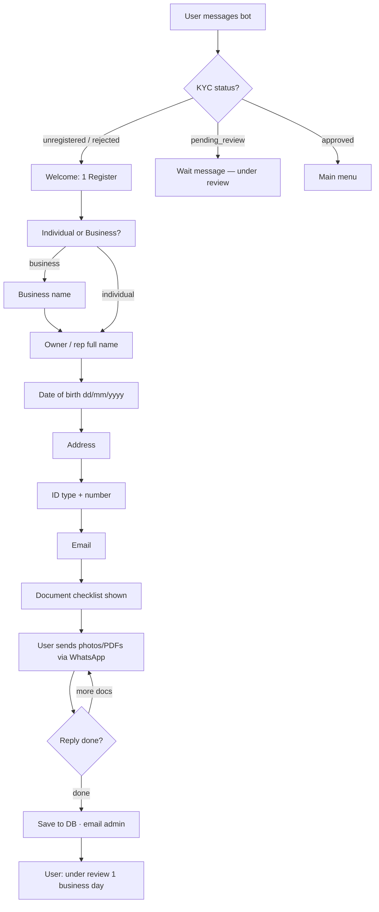
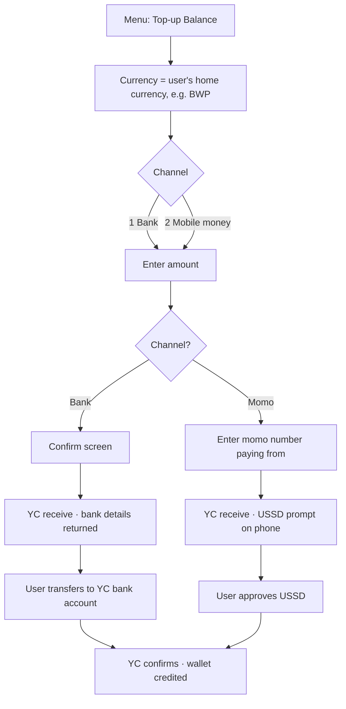
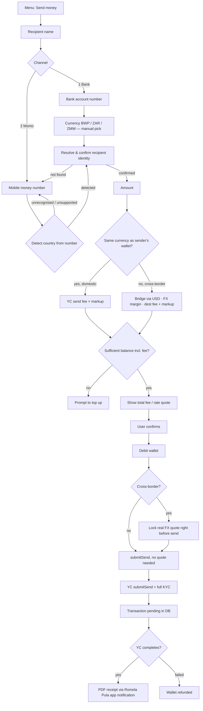
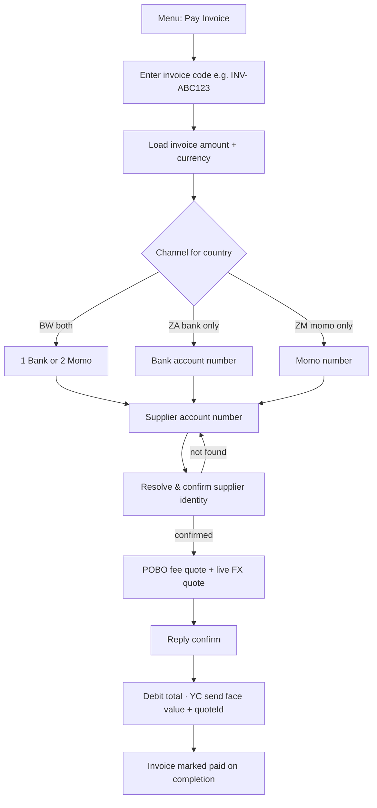

# Romela Pula — WhatsApp + Installable Web App

Romela Pula lets individuals and businesses register, verify their identity, fund an internal wallet, and send money or pay invoices to bank accounts and mobile money wallets across **19 African countries** (plus send-only corridors), per your **YC Addendum 1** fee schedule.

Customers can use **WhatsApp** (via Twilio) or the **installable web app (PWA)** at your Vercel URL — both share the same backend, wallet, and conversation logic.

Each user has exactly **one wallet**, in their **home currency** — auto-detected from their phone number's dial code (e.g. `+267…` → BWP, `+234…` → NGN). **Only supported African country codes can register** (see Country & channel coverage); numbers from other countries (e.g. UK `+44`) are blocked with a message listing accepted codes.

Built with **Twilio WhatsApp** + **PWA** + **Node.js on Vercel** + **Supabase Postgres** + **Yellow Card** (fiat settlement).

---

## What the bot does

| Capability | Individuals | Businesses |
|------------|:-----------:|:----------:|
| Register (KYC/KYB) with document upload | ✅ | ✅ |
| Manual admin approval via email | ✅ | ✅ |
| One home-currency wallet (auto-detected from phone number) | ✅ | ✅ |
| Top-up via **bank transfer** | BW, ZA | BW, ZA |
| Top-up via **mobile money** | BW, ZM | BW, ZM |
| Send money domestically (bank or momo, same currency) | ✅ | ✅ |
| Send money cross-border (momo, auto-detected recipient currency) | ✅ | ✅ |
| Pay supplier invoice | — | ✅ |
| Create invoice (share code with customer) | — | ✅ |
| Check balance | ✅ | ✅ |
| Transaction history (last 5) | ✅ | ✅ |
| Status lookup (reference / invoice code) | — | ✅ |
| PDF remittance receipt on completed sends | ✅ | ✅ |

---

## Architecture

```
Customer WhatsApp ──► Twilio ──► /api/whatsapp.js ──┐
                                                     ├──► lib/conversation.js
Customer PWA (/) ──► /api/app.js ──────────────────┘
                                │
              ┌─────────────────┼─────────────────┐
              ▼                 ▼                 ▼
         Supabase DB      Yellow Card API    Resend (KYC email)
    users · wallets ·     receive (top-up)         │
    sessions · txns ·     send (payout)            ▼
    invoices · kyc         webhooks          /api/admin-kyc-*
              │                 │
              │                 ▼
              │     /api/yellowcard-webhook.js
              │                 │
              └────────► Twilio WhatsApp reply (inbound bot only) + PWA notification inbox (receipts, KYC, settlements)
                         (PWA shows replies in-browser)
```

### API endpoints

| Endpoint | Purpose |
|----------|---------|
| `GET /` | Romela Pula PWA (installable web app) |
| `POST /api/app` | PWA API — login, chat messages, KYC uploads |
| `POST /api/whatsapp` | Incoming Twilio WhatsApp messages (text + media) |
| `GET/POST /api/admin` | Operator dashboard (money in/out, CSV export) |
| `POST /api/yellowcard-webhook` | Yellow Card payment status events |
| `GET /api/poll-transactions` | Cron poller — pending top-ups, sends, invoice payments, and PDF receipts (`/api/poll-topups` alias) |
| `GET /api/receipt?id=` | PDF remittance receipt (completed sends only) |
| `GET /api/admin-kyc-decision` | Approve or reject registration (email link) |
| `GET/POST /api/admin-kyc-request-info` | Request more KYC documents (email link) |

---

## Security

### Yellow Card webhook signature (required)

Every `POST /api/yellowcard-webhook` request is verified before processing:

1. Read the raw request body (no JSON re-serialization)
2. Compute `HMAC-SHA256(rawBody, YELLOWCARD_SECRET_KEY)` → base64
3. Compare to `X-YC-Signature` or `Yellowcard-Signature`
4. **Mismatch → `401 Unauthorized`** — request is dropped, no side effects

### Atomic settlement (no double-credit)

Top-up credits and send refunds use Postgres RPC functions (`claim_topup_credit`, `claim_send_refund`, etc.) with **`SELECT … FOR UPDATE`** row locks. Only one of webhook / cron / per-message poller can win — losers skip wallet mutation.

Run the RPC block at the bottom of `db/schema.sql` in Supabase after deploying.

### Production outbound IP (Vercel)

Vercel serverless functions use **dynamic outbound IPs**. If Yellow Card enforces IP whitelisting in production, outbound API calls may be blocked.

| Approach | Notes |
|----------|-------|
| **Fixie / QuotaGuard** | Static IP proxy for outbound YC API calls |
| **Vercel Secure Compute** | Vercel add-on for static egress IP |
| **Render / Railway** | Migrate backend to static-egress host |
| **YC inbound webhooks** | YC sends production webhooks from a static IP — whitelist that |

---

## Two balances (important)

The bot uses **two separate balances**. They are not the same thing.

| Balance | Where | What it is |
|---------|-------|------------|
| **User wallet** | Supabase `wallets` table | What the customer sees in WhatsApp. Debited on send; credited on top-up. |
| **YC Treasury** | Yellow Card dashboard | Stablecoin balance (USD) that Yellow Card uses to settle fiat payouts. |

- **Top-up (menu)** → calls Yellow Card **receive** API → credits the **user wallet** when payment completes.
- **Send / Pay invoice** → debits the **user wallet** → calls Yellow Card **send** API → YC pays out from **Treasury**.

You must fund the YC Treasury separately (stablecoin deposit in the Treasury Portal). See [YC Balance Top up docs](https://docs.yellowcard.engineering/docs/settlement-api.md).

---

## Country & channel coverage

Yellow Card corridors enabled in this bot — aligned with **YC Addendum 1** (Payments API Fee Schedule) and `lib/yellowcard.js`:

| Country | Currency | Top-up bank | Top-up momo | Send bank | Send momo |
|---------|----------|:-----------:|:-----------:|:---------:|:---------:|
| Benin | XOF | ❌ | ✅ | ❌ | ✅ |
| Burkina Faso | XOF | ❌ | ✅ | ❌ | ✅ |
| Botswana | BWP | ✅ | ✅ | ✅ | ✅ |
| Cameroon | XAF | ❌ | ✅ | ❌ | ✅ |
| Chad | XAF | ❌ | ✅ | ❌ | ✅ |
| Congo Brazzaville | XAF | ❌ | ✅ | ❌ | ✅ |
| DR Congo | CDF | ❌ | ❌ | ❌ | ✅ *(send-only)* |
| Ethiopia | USD | ❌ | ❌ | ✅ *(send-only)* | ❌ |
| Ivory Coast | XOF | ❌ | ✅ | ❌ | ✅ |
| Gabon | XAF | ✅ | ✅ | ❌ | ✅ |
| Kenya | KES | ✅ | ✅ | ✅ | ✅ |
| Malawi | MWK | ✅ | ✅ | ✅ | ✅ |
| Mali | XOF | ❌ | ✅ | ❌ | ✅ |
| Nigeria | NGN | ✅ | ❌ | ✅ | ❌ |
| Rwanda | RWF | ✅ | ✅ | ✅ | ✅ |
| Senegal | XOF | ❌ | ✅ | ❌ | ✅ |
| South Africa | ZAR | ✅ | ❌ | ✅ | ❌ |
| Tanzania | TZS | ✅ | ✅ | ✅ | ✅ |
| Togo | XOF | ❌ | ✅ | ❌ | ✅ |
| Uganda | UGX | ✅ | ✅ | ✅ | ✅ |
| Zambia | ZMW | ✅ | ✅ | ✅ | ✅ |

### LATAM (send / payout only)

Per YC Addendum §3 — bank disbursements only; no local wallet or top-up:

| Country | Currency | Send bank |
|---------|----------|:---------:|
| Argentina | ARS | ✅ |
| Brazil | BRL | ✅ |
| Colombia | COP | ✅ |
| Mexico | MXN | ✅ |

Cross-border sends from an African home wallet to LATAM use the same live `getFeeConfig` + Romela Pula markup model (tiered BWP flat + 1.5× YC fee). Fees are not hardcoded from the addendum.

**Registration (19 African countries):** WhatsApp dial code must match a registerable corridor in the Africa table. **DR Congo**, **Ethiopia**, and **LATAM** are payout destinations only — no local wallet/top-up.

**YC fees:** The addendum defines YC's B2B collection/disbursement fees per country. Romela Pula still quotes live fees via `getFeeConfig` and adds its own tiered markup on top.

**Not in addendum:** Namibia, Zimbabwe — still excluded.

**Transaction limits:** minimum **10**, maximum **100,000** (local currency units) per transaction.

**Card top-up:** not available via Yellow Card’s direct API. Only bank and mobile money are supported.

---

## Menus

### Welcome (unregistered / rejected users)

```
Welcome to Romela Pula 👋
1️⃣ Register
2️⃣ Help
```

### Individual menu (after KYC approval)

```
1️⃣ Send money to bank or mobile wallet
2️⃣ Top-up Balance
3️⃣ Check Balance
4️⃣ Transaction History
```

### Business menu (after KYC approval)

```
1️⃣ Pay Invoice (pay a supplier)
2️⃣ Send money to bank or mobile wallet
3️⃣ Top-up Balance
4️⃣ Check Balance
5️⃣ Check invoice / transaction status
6️⃣ Transaction History
7️⃣ Create Invoice
```

Reply **hi**, **hello**, **menu**, or **start** anytime to return to the main menu.

---

## Workflow 1 — Customer registration (Individual & Business)

Registration is open to WhatsApp numbers from any **registerable African corridor** in `lib/yellowcard.js` (19 countries — see Country & channel coverage). Any other dial code (e.g. UK `+44`, US `+1`) receives a message listing accepted country codes and cannot proceed.

Both account types follow the same steps after choosing account type. Businesses collect one extra field (business name) and require more documents.



### Individual — documents required

1. Government-issued photo ID (National ID, Passport, or Driver's Licence)
2. Proof of address (utility bill or bank statement, within 3 months)
3. Selfie holding the ID document

### Business — documents required (KYB)

1. Certificate of Incorporation / Business Registration
2. Company tax registration certificate
3. Proof of business address (within 3 months)
4. Government-issued photo ID of authorised representative
5. Proof of address of authorised representative (within 3 months)
6. Selfie of representative holding their ID
7. Latest audited financial statements or management accounts (if available)

### What happens after submission

1. User record saved with `kyc_status = pending_review`
2. Documents stored in `kyc_submissions` (Twilio media URLs or PWA refs `web:{uuid}`)
3. Admin receives email (Resend) with attachments and three actions:
   - **Approve** → `kyc_status = approved`, home-currency wallet created at 0, Romela Pula app notification with fee schedule link
   - **Reject** → `kyc_status = rejected`, user notified in the Romela Pula app
   - **Request More Info** → admin adds optional note, user gets an in-app notification to resubmit

Until approved, only the welcome screen and help text are available — no payments.

---

## Workflow 2 — Top-up balance (fund user wallet)

Top-up uses Yellow Card’s **receive** API. There's no currency choice — the bot already knows the user's home currency (derived from their WhatsApp number), so it goes straight to channel/amount. Before the top-up is submitted, the bot quotes Yellow Card's collection fee for that amount (`getFeeConfig` with `txType: receive`), adds Romela Pula's **BWP 10 flat fee** (converted to the wallet currency when needed) plus **20% markup on the YC fee** (customer pays **1.2×** YC collection fee in total), and tells the customer that fee will be deducted when the top-up completes. When YC confirms payment, the user's **one wallet** is credited the **net** amount (gross top-up minus fee).

| Component | Calculation | Env var |
|-----------|-------------|---------|
| **Top-up fee** | BWP 10 flat + **1.2×** YC receive/collection fee | `TOPUP_FLAT_FEE_BWP` / `TOPUP_YC_FEE_MULTIPLIER` (default `10` / `1.2`) |
| **Wallet credit** | `gross top-up − (yc_fee + markup)` on `RECEIVE.COMPLETE` | — |

Example: a **9,000 BWP** momo top-up where YC's collection fee is **90 BWP** → Romela Pula markup **28 BWP** (10 flat + 18) → customer sees *"A top-up fee of 118.00 BWP will be deducted… 8,882.00 BWP will be added to your wallet"* → on success, **8,882 BWP** is credited.

**Supabase:** re-run the `claim_topup_credit` function from `db/schema.sql` so wallet credits use the net amount after fees.

### Top-up — Botswana (BWP) — bank or momo



### Top-up — South Africa (ZAR) — bank only

1. Home currency is ZAR → bank is the only channel, so no channel-choice step
2. Enter amount → **confirm**
3. Bot returns Yellow Card bank details + payment reference (`receive.reference`, e.g. `BSM6435281`)
4. User makes bank transfer with that reference
5. Wallet credited when YC marks receive complete

### Top-up — Zambia (ZMW) — mobile money only

1. Home currency is ZMW → momo is the only channel
2. Enter amount
3. Enter mobile money number (normalised to `+260…`)
4. USSD prompt sent to that number — user must approve
5. Wallet credited on completion

### Top-up settlement paths

Settlement uses **atomic Postgres RPCs** (`lib/settlement.js`) so webhook + cron cannot double-credit:

1. **Yellow Card webhook** (`RECEIVE.COMPLETE`) — primary
2. **Per-message poll** — `settlePending()` at the start of every incoming message
3. **Cron poller** — `GET /api/poll-transactions?secret=…` every 2–5 minutes
4. **Immediate poll** — right after `submitReceive` returns

Only the first successful `claim_topup_credit` call credits the wallet.

---

## Workflow 3 — Send money (Individual & Business)

Send money always debits the sender's **one home-currency wallet**. What happens next depends on whether the recipient is in the **same** currency (domestic) or a **different** one (cross-border):



### Step-by-step (send money)

| Step | User input | Bot action |
|------|------------|------------|
| 1 | Recipient name | Saves to session |
| 2 | `1` bank or `2` momo | Sets `channelType` |
| 3a | Momo number | **Country/currency auto-detected** from the number's dial code (e.g. `+260…` → ZMW). Rejected with a clear message if unrecognised or unsupported for momo. |
| 3b | Bank account number | Currency still asked manually (bank numbers carry no dial code) |
| 4 | — | **Recipient identity resolved** (bank via Yellow Card; manual confirm for momo — see below). Bot shows the name and asks `1` Yes / `2` No before continuing. |
| 5 | Amount | Computed in the **sender's wallet currency** |
| 6 | — | Domestic → YC fee + tiered Romela Pula markup. Cross-border → user enters **total wallet debit (fees included)**; bot solves payout from YC destination-leg fee + tiered markup and bridged FX with 2% margin. |
| 7 | `confirm` | Debits wallet; cross-border sends lock a fresh live quote right before `submitSend` |
| 8 | — | User told payout is processing; receipt follows |

### Recipient identity verification — never blindly execute a payout

Before any amount is even asked, the bot resolves and confirms who the money is actually going to:

- **Bank transfers** — calls Yellow Card's `POST /business/details/bank` (Resolve Bank Account) with the account number + a network for that country. If it returns an `accountName`, the bot shows it (*"We found this account: **Jane Doe**"*) and requires `1` (yes) / `2` (no, re-enter the number) before continuing. A `ResolveAccountError`/"not found" response prompts the user to double-check the number and re-enter it — the flow never falls through to a payout.
- **Mobile money** — Yellow Card has no equivalent name-resolution endpoint for momo (bank-only, and only guaranteed for select countries). The bot instead falls back to an explicit manual confirmation of the name the sender already typed in at step 1 (*"We can't independently verify mobile money account names for this corridor yet... you're sending to **\<name>** at \<number>"*), with the same `1`/`2` gate.
- If the resolution call itself is unavailable/errors for a given corridor (not a "not found" response — just an unsupported/unreachable lookup), the bot fails **soft** into the same manual-confirmation prompt rather than blocking sends outright.
- This same gate applies to **both** plain sends (this workflow) and manual-entry invoice payments (Workflow 4B) — anywhere a payout is about to be submitted to a third-party recipient.

### Domestic sends (same currency in and out)

No FX conversion — the recipient receives exactly the amount entered. The fee is Yellow Card's disbursement fee (`getFeeConfig`) plus Romela Pula's **tiered BWP flat fee** (converted to the send currency when needed) and **50% markup on the YC fee** — shown as a **single combined total**:

| Transaction size (BWP equivalent) | Romela Pula flat fee |
|----------------------------------|------------------|
| ≤ 500 | BWP 5 |
| 501 – 2,000 | BWP 15 |
| 2,001 – 5,000 | BWP 25 |
| 5,001 – 25,000 | BWP 40 |
| 25,001 – 100,000 | BWP 50 |
| 100,001 – 500,000 | BWP 100 |
| > 500,000 | BWP 200 |

```
customerFee = ycFee + flatTierFee + (0.5 × ycFee)   // = flat + 1.5 × ycFee
totalDebit  = amount + customerFee
```

Example: 1,000 BWP domestic send with YC fee 10 BWP → Romela Pula flat **15 BWP** (tier 501–2,000) + YC markup **5 BWP** → customer fees **30 BWP** (10 + 15 + 5).

### Cross-border sends (different currency in and out)

The recipient's currency is auto-detected from their momo number (bank cross-border isn't currently exposed — currency is manually picked and validated against the channel, same as before). The sender enters the **total wallet debit** — **fees are included** in that amount (not added on top). The bot solves iteratively how much of that total funds the FX conversion vs fees:

```
principalFx = totalEntered − (ycFeeWallet + markup)
recipient gets ≈ principalFx × displayRate
```

| Component | Calculation | Env var |
|-----------|-------------|---------|
| **Service fee** | Same tiered BWP flat + 1.5× YC disbursement fee as domestic (tier basis = FX principal in wallet currency, converted to BWP for tier lookup) | `ROMELA_PULA_YC_FEE_MULTIPLIER` (default `1.5`) |
| **FX rate** | YC `/business/rates` bridged via USD, with **2%** margin shaved off (`displayRate = bridgedRate × 0.98`) | `CROSSBORDER_FX_MARGIN_PCT` |
| **VIP FX margin** | 1% instead of 2%, for **business** accounts sending **BWP → South Africa (ZAR)** of at least **500,000 BWP** | `CROSSBORDER_VIP_FX_MARGIN_PCT` / `CROSSBORDER_VIP_MIN_AMOUNT_BWP` |

Example: user enters **1,000 BWP** total (fees included) → ~**17 BWP** fee deducted internally → ~**983 BWP** converted → recipient gets ≈ **1,293 ZMW** at rate 1.3157.

The rate/recipient-amount shown before confirm is an **estimate from `/business/rates`** (with your FX margin applied). Yellow Card **locks the real payout rate on `submitSend`** (~10 minute window per their docs) — there is no separate `/business/quotes` endpoint in the public API. Workflow 4 (invoice payments) still shows a timed rate estimate before confirm; the final lock happens at `submitSend`.

### Yellow Card payload (sends)

For BWP / ZAR / ZMW, **full sender KYC** is always sent (Tier 0 reduced KYC does not apply):

- `name`, `country`, `phone`, `address`, `dob`, `email`, `idNumber`, `idType` — `country`/`phone` always reflect the **sender's own home country**, even on cross-border sends where `destination.country` differs
- `customerUID` (user’s phone digits)
- Rate estimate — from `/business/rates` + business margin; **final rate locks on `submitSend`**
- `reason`: `other` (send) or `bills` (invoice payment)
- `destination.country`, `networkId` (auto-selected from active YC networks)
- `forceAccept: true` on `submitSend` — no separate accept step needed

### Send settlement & receipt

When Yellow Card marks the send **complete**:

1. Transaction status → `completed`
2. PDF receipt generated at `/api/receipt?id=<txn_uuid>`
3. Romela Pula app notification with signed receipt link sent to payer
4. `receipt_sent` flag set (prevents duplicates)

If send **fails** → wallet amount refunded, user notified.

### Send / payment settlement paths

Settlement uses the same atomic RPCs as top-ups (`claim_send_complete`, `claim_send_refund`, `claim_receipt_sent`):

1. **Yellow Card webhook** (`SEND.COMPLETE` / payment events) — primary
2. **Per-message poll** — `settlePending()` at the start of every inbound WhatsApp message (that user only)
3. **Cron poller** — `GET /api/poll-transactions?secret=…` every 2–5 minutes (**all users**)
4. **Immediate poll** — right after `submitSend` returns

The cron poller is what delivers the **PDF receipt automatically** when a payout completes and the customer does not send another message. It also recovers stuck receipts (`status = completed`, `receipt_sent = false`).

---

## Workflow 4 — Pay invoice (Business only)

Invoice payments use the **same Romela Pula service-fee model** as sends (tiered BWP flat + 1.5× YC disbursement fee). The supplier always receives the invoice face value **in the invoice's own currency**; the payer's home-currency wallet is debited the total (face + fees + FX margin when cross-currency).

### Fee formula (`lib/fees.js`)

| Component | Calculation |
|-----------|-------------|
| **Supplier receives** | Invoice face value, in the invoice's own currency |
| **Yellow Card disbursement fee** | Live `getFeeConfig` for send / recipient corridor |
| **Romela Pula service fee** | Tiered BWP flat (see table above) + **0.5 × YC fee** (customer pays **1.5 × YC fee** total) |
| **Invoice-currency charge** | Face value + YC fee + Romela Pula markup (`markup_amount` = flat + 0.5×YC) |

Configure via `.env`: `ROMELA_PULA_YC_FEE_MULTIPLIER` (default `1.5`).

### Romela Pula profit on a transaction

Romela Pula gross profit has up to **three** components:

| Component | Formula | Notes |
|-----------|---------|-------|
| **Flat tier fee** | Full BWP tier amount (converted to fee currency) | 100% profit — no pass-through |
| **YC fee markup** | `0.5 × yc_fee_amount` | Customer pays 1.5× YC fee; YC keeps 1×, Romela Pula keeps 0.5× |
| **FX margin** | Cross-border only: `walletDebit − (face / bridgedRate) − serviceFeesWallet` | From 2% (or 1% VIP) shave on bridged rate; not stored separately — derive from txn fields |

Stored on `transactions`: `yc_fee_amount` (pass-through to YC), `markup_amount` (flat + 0.5×YC in invoice/send currency). **Service profit** ≈ `markup_amount`. **Total profit** adds FX margin on cross-currency legs.

Example — **50,000 ZAR** invoice, **BWP** wallet, YC fee **250 ZAR**, bridged principal ≈ **41,300 BWP**:

- Tier: 25,001–100,000 → flat **50 BWP**
- YC fee profit: **125 ZAR** (0.5 × 250)
- FX margin: ≈ **2%** of bridged principal ≈ **~825 BWP**
- **Total Romela Pula profit** ≈ **50 BWP + 125 ZAR + ~825 BWP** (convert ZAR leg at prevailing rate for a single-currency total)

### Cross-currency invoices — bridged to the payer's home wallet

If the invoice's currency differs from the payer's `home_currency` (e.g. a BWP-wallet business paying a ZAR invoice), the invoice-currency total above is converted back to the wallet's currency using the **exact same bridging math as Workflow 3's cross-border sends** (`buildInvoiceWalletBridge`, sharing `getBridgedRate`/`getCrossBorderMargin` with `buildCrossBorderEstimate`) — just solved in the opposite direction, since here the *destination* amount (the invoice total) is fixed and the *wallet* debit is what needs to be calculated:

```
bridgedRate  = (invoiceCurrency per USD) / (walletCurrency per USD)
displayRate  = bridgedRate × (1 − marginPct)     ← same CROSSBORDER_FX_MARGIN_PCT / VIP margin as Workflow 3
walletDebit  = invoiceCurrencyTotal / displayRate
```

The wallet is debited `walletDebit` (in `home_currency`); the supplier still receives the invoice's face value in the invoice's own currency via `submitSend`. The quote shown to the user calls out the bridging rate explicitly and labels the total debit with the wallet's currency, not the invoice's. This applies to **both** ways of paying a supplier below.

Two ways to pay a supplier:

### A) Pay by invoice code



### B) Manual entry (skip invoice code)

1. Pay Invoice → reply **skip**
2. Enter supplier name → channel → account (momo auto-detects the supplier's country/currency, same as Workflow 3)
3. **Supplier identity resolved & confirmed** (same gate as Workflow 3 — see [Recipient identity verification](#recipient-identity-verification--never-blindly-execute-a-payout))
4. Amount → reference
5. Same POBO + live-FX-quote payout flow as before (`type = invoice_payment`, with the wallet-bridging above applied when the invoice's currency differs from `home_currency`) — **not** the new domestic/cross-border fee *model* from Workflow 3, just the same bridging math where relevant

---

## Workflow 5 — Create invoice (Business only)

| Step | Input |
|------|-------|
| 1 | Currency (`BWP`, `ZAR`, `ZMW`) |
| 2 | Amount |
| 3 | Description |

Bot returns an invoice code (e.g. `INV-A1B2C3`) to share with the customer. The customer (or another business) pays via **Pay Invoice** using that code.

Invoices stay `pending` until a linked `invoice_payment` transaction completes.

---

## Workflow 6 — Check balance, history & status

### Check balance (both account types)

- Polls pending transactions first (`settlePending`)
- Returns all currency balances, e.g. `BWP: 5000.00`

### Transaction history (both)

- Last **5** transactions with type, amount, status, recipient

### Status lookup (business only)

Accepts:

- Yellow Card reference (UUID from payout/top-up)
- Internal payment reference
- Invoice code (`INV-…`)

Polls Yellow Card before displaying status. Pending sends may complete and trigger receipt delivery during lookup.

---

## Sandbox testing

Use Yellow Card sandbox: `YELLOWCARD_BASE_URL=https://sandbox.api.yellowcard.io`

Fund the **YC Treasury** in the sandbox dashboard (stablecoin top-up address). Sandbox accounts often ship with pre-funded balance.

### Test account numbers

Per [YC Sandbox Testing](https://docs.yellowcard.engineering/docs/sandbox-testing-api.md):

| Type | Success | Failure |
|------|---------|---------|
| Bank account | `1111111111` | `0000000000` |
| Mobile money | `+{countryCode}1111111111` | `+{countryCode}0000000000` |

**Botswana momo success:** `+2671111111111`  
**Botswana / South Africa bank success:** `1111111111` — the bot injects this automatically on sandbox bank top-ups (no manual transfer needed)  
**Zambia momo success:** `+2601111111111`

Real phone numbers in sandbox may stay **pending** indefinitely. Production bank top-ups still require a real transfer to the `bankInfo` account YC returns.

---

## Setup

### 1. Supabase

1. Create a project at https://app.supabase.com
2. Run `db/schema.sql` in the SQL Editor (safe to re-run)
3. Copy **Project URL** → `SUPABASE_URL`
4. Copy **service_role** key → `SUPABASE_SERVICE_ROLE_KEY`

### 2. Twilio WhatsApp

1. Create an account at https://www.twilio.com
2. Enable **WhatsApp** — use the **Sandbox** for testing (`join <code>` from your phone)
3. Copy **Account SID** → `TWILIO_ACCOUNT_SID`, **Auth Token** → `TWILIO_AUTH_TOKEN`
4. Set **Sandbox number** (or production sender) → `TWILIO_WHATSAPP_NUMBER` (e.g. `whatsapp:+14155238886`)
5. After Vercel deploy, set the webhook URL in Twilio Console → **Messaging → WhatsApp Sandbox settings** (or your sender):
   - **When a message comes in:** `https://<your-app>.vercel.app/api/whatsapp`
   - Method: **POST**
6. Set `PUBLIC_APP_URL` to your Vercel root URL (no `/api/whatsapp` suffix)

### 2b. Romela Pula PWA

1. Run `db/migrations/003_app_documents.sql`, `004_pwa_csw.sql`, and `005_user_notifications.sql` in Supabase
2. Set `APP_SESSION_SECRET` in Vercel (long random string)
3. Deploy — customers open `https://<your-app>.vercel.app/` on mobile
4. **Install:** Chrome/Edge → menu → **Install app**; iOS Safari → Share → **Add to Home Screen**

**Customer activation (required — keeps Twilio inside WhatsApp CSW):**

1. Customer messages your Romela Pula **WhatsApp number**
2. Customer replies **`app`** (also accepts `pwa`, `web`, `activate`)
3. Bot sends the PWA link — this opens the **24-hour customer service window**
4. Within 24 hours, customer opens the PWA, enters the same phone number, and receives the login code **on WhatsApp**
5. After 24 hours without messaging WhatsApp, they must message again (reply **`app`**) before the PWA can send another login code

The PWA chat itself uses `/api/app` (no Twilio). **Only the login OTP** uses Twilio, and only when CSW is open after customer activation.

The PWA reuses the same menu/state machine as WhatsApp — type `menu`, tap quick replies, or upload KYC documents with the 📎 button.

**In-app notifications (no WhatsApp fallback):**

KYC approve/reject/more-info, receipts, top-up/settlement updates, and marketing messages are stored in the PWA **bell inbox** (`user_notifications` table). Customers must open the app to see them — nothing is sent proactively on WhatsApp except the login code.

- Bell icon + unread badge in the PWA header (polls every 60s)
- Tap a notification to mark read and open links (e.g. receipt PDF, fee schedule)
- KYC registration copy tells users they'll hear back **in the Romela Pula app**, not on WhatsApp

### 3. Yellow Card

1. Get sandbox credentials from https://docs.yellowcard.engineering
2. Set `YELLOWCARD_API_KEY`, `YELLOWCARD_SECRET_KEY`, `YELLOWCARD_BASE_URL`
3. Register webhook: `https://<your-app>.vercel.app/api/yellowcard-webhook`
   - Subscribe to: `RECEIVE.COMPLETE`, `RECEIVE.FAILED`, `SEND.COMPLETE`, `SEND.FAILED`
4. Fund Treasury balance in the YC dashboard before testing sends

### 4. Resend (KYC emails)

- `RESEND_API_KEY` from https://resend.com/api-keys
- `RESEND_FROM_EMAIL` — `Romela Pula <onboarding@resend.dev>` works for testing
- `ADMIN_EMAIL` — where review emails are sent

### 5. Deploy to Vercel

1. Push to GitHub and import in Vercel
2. Add all variables from `.env.example`
3. Set `PUBLIC_APP_URL` to your Vercel URL (no trailing slash) and redeploy
4. Configure Twilio and YC webhooks with the live URL

### 6. Cron poller (required for automatic PDF receipts)

Vercel **free tier has no built-in cron**. Use **one** external cron job (not separate jobs for top-ups vs payments) to hit this endpoint every 2–5 minutes:

```
https://<your-app>.vercel.app/api/poll-transactions?secret=<CRON_SECRET>
```

(`/api/poll-topups` is the same handler — use either URL.)

Or send header `x-cron-secret: <CRON_SECRET>` (no secret in URL).

**What this single cron job does:**

| Pending state | Action |
|---------------|--------|
| Top-up not yet credited | Poll YC → credit wallet → WhatsApp confirmation |
| Send / invoice payment still processing | Poll YC → mark complete or refund wallet |
| Send completed but no PDF yet (`receipt_sent = false`) | Generate signed receipt URL → Romela Pula app notification with link |

Without this cron, customers who initiate a send or invoice payment and then **do not message again** may not receive their PDF receipt until they return (webhooks and per-message polling only run when something else triggers the app).

#### cron-job.org setup (free)

1. Generate a secret: `openssl rand -hex 32`
2. Add `CRON_SECRET` in Vercel → Settings → Environment Variables → **Production**, then **redeploy**
3. Test in browser: `https://<your-app>.vercel.app/api/poll-transactions?secret=<CRON_SECRET>` → expect `{"polled":0,"message":"Nothing pending"}`
4. Sign up at [cron-job.org](https://cron-job.org) → **Create cronjob**
5. URL: your `poll-transactions` URL above; method **GET**; schedule **every 5 minutes**; timeout **60s**
6. Run once manually → confirm HTTP **200** in execution history; check Vercel function logs for `[POLL]`
7. After a test send completes on YC sandbox, wait for the next cron run → logs should show `send_completed` or `receipt_sent`

---

## Environment variables

See `.env.example` for the full list:

| Variable | Purpose |
|----------|---------|
| `TWILIO_ACCOUNT_SID` / `TWILIO_AUTH_TOKEN` / `TWILIO_WHATSAPP_NUMBER` | Twilio WhatsApp |
| `APP_SESSION_SECRET` | PWA customer login + OTP signing |
| `SUPABASE_URL` / `SUPABASE_SERVICE_ROLE_KEY` | Database |
| `YELLOWCARD_API_KEY` / `YELLOWCARD_SECRET_KEY` / `YELLOWCARD_BASE_URL` | Payments API + webhook HMAC |
| `ROMELA_PULA_YC_FEE_MULTIPLIER` | Service fee multiplier on YC disbursement fee — customer pays this × YC fee; Romela Pula keeps `(multiplier − 1) × YC fee` (default `1.5`) — applies to sends and invoice payments |
| `FX_RATE_MULTIPLIER_BASE` / `QUOTE_LOCK_MINUTES` | Outbound quote margin/lock display |
| `CROSSBORDER_FX_MARGIN_PCT` / `CROSSBORDER_VIP_FX_MARGIN_PCT` | Cross-border FX margin, standard vs VIP corridor (default `0.02` / `0.01`) — also used to bridge cross-currency invoice payments (Workflow 4) back to the payer's wallet |
| `CROSSBORDER_VIP_MIN_AMOUNT_BWP` | Minimum BWP amount for the VIP FX margin (default `500000`) |
| `TOPUP_FLAT_FEE_BWP` / `TOPUP_YC_FEE_MULTIPLIER` | Top-up fee: BWP flat + multiplier on YC collection fee (default `10` / `1.2`) — deducted from wallet credit on completion |
| `RESEND_API_KEY` / `RESEND_FROM_EMAIL` / `ADMIN_EMAIL` | KYC review emails |
| `PUBLIC_APP_URL` | Deployment root URL only (e.g. `https://your-app.vercel.app`) — used for KYC email links, receipts, webhooks. **Not** the `/api/whatsapp` path |
| `CRON_SECRET` | Protects `/api/poll-transactions` (**required in production**) |
| `RECEIPT_SIGNING_SECRET` | HMAC secret for signed PDF receipt URLs (**recommended in production**; falls back to `CRON_SECRET`) |
| `SENTRY_DSN` | Optional Sentry DSN for production error alerts |

---

## Production hardening

### Row Level Security (Supabase)

After running `db/schema.sql`, apply RLS in the Supabase SQL editor:

```bash
# File: db/migrations/001_enable_rls.sql
```

This enables deny-all policies for `anon` and `authenticated` on all tables. The Vercel backend uses `SUPABASE_SERVICE_ROLE_KEY`, which bypasses RLS.

**Verify:** With the anon key, `GET /rest/v1/wallets` should return no rows (or 401).

### Automated tests

```bash
npm install
npm test
```

Tests cover tiered fees, invoice quotes, cross-border FX solving, receipt fee reconstruction, integer-safe money math (`lib/money.js`), and receipt URL signing (`tests/`).

### Integer-safe money math

Settlement-critical paths use `lib/money.js` (minor-unit arithmetic) instead of raw `parseFloat` chains. This prevents cent-level drift on fee totals, FX conversions, and wallet debits.

### Signed receipt URLs

When `RECEIPT_SIGNING_SECRET` (or `CRON_SECRET`) is set in production, `/api/receipt` requires a valid `sig` query param. Receipt links sent via WhatsApp are signed automatically by `lib/receipt-delivery.js`.

### Error tracking

Set `SENTRY_DSN` in Vercel production env. Errors from WhatsApp, Yellow Card webhooks, and the cron poller are captured via `lib/observability.js`.

---

## Data model (Supabase)

| Table | Purpose |
|-------|---------|
| `users` | One row per WhatsApp phone; KYC fields; `account_type`; `kyc_status`; `home_currency` / `home_country` (auto-detected from supported dial codes); `fx_margin_pct` (invoice payments only) |
| `kyc_submissions` | Document URLs, approval token, admin decisions |
| `sessions` | Conversation state machine (`state` + `context` JSON) |
| `wallets` | Balance per user per currency — in practice always exactly one row (the user's `home_currency`) |
| `transactions` | Top-ups, sends, invoice payments; `currency`/`amount` = wallet debit/credit; `payout_currency`/`payout_amount` = what the recipient actually received (differs from `currency` on cross-border sends *and* cross-currency invoice payments); `quote_id`; `margin_pct` (bridging margin when cross-currency, else the settlement-quote margin); `wallet_credited` / `wallet_refunded` |
| `invoices` | Business-created invoices with shareable codes; `country` + `currency` for payout routing |

---

## Known limitations & production notes

- **KYC** — format validation + manual document review; no automated ID verification
- **Network selection** — bot auto-picks provider (MyZaka, Orange, Mascom, BTC heuristic); no user-facing network menu
- **No admin dashboard** — use Supabase table editor or build one later
- **Production IP whitelist** — Vercel uses dynamic outbound IPs; route YC API calls through Fixie, QuotaGuard, Vercel Secure Compute, or migrate to Render/Railway
- **Webhook auth** — invalid `X-YC-Signature` / `Yellowcard-Signature` returns `401` and is not processed
- **Settlement RPCs** — must run `db/schema.sql` RPC block in Supabase for atomic credits/refunds
- **Recipient identity resolution is bank-only on Yellow Card's side** — `POST /business/details/bank` has no mobile-money equivalent, so momo recipients get a manual name-confirmation prompt instead of an API-verified one. Bank resolution itself is also only guaranteed for select countries per Yellow Card's docs; unsupported/errored lookups fail soft into the same manual-confirm flow rather than blocking the send
- **Cross-border sends are momo-only** — the recipient's country/currency is deduced from their momo number's dial code; bank cross-border sends still require the sender to manually pick the recipient's currency (no way to infer it from a bare bank account number)
- **Cross-border FX margin** — dynamic per transaction (2% standard, 1% VIP corridor — see Workflow 3), not the static per-user `fx_margin_pct` column (that column is used only for invoice payments' own settlement-quote leg, Workflow 4 — a separate rate concept from the wallet-bridging margin)
- **No rate limiting** on webhooks beyond Twilio signature + `CRON_SECRET`
- **YC API retries** — transient failures surface as user-visible errors; wallet refunds on failed debits where applicable
- **Old pending transactions** from before payload fixes may need Yellow Card support to cancel

---

## Production E2E checklist

Run this matrix on **production Yellow Card** before go-live (not sandbox):

| # | Flow | Verify |
|---|------|--------|
| 1 | Registration + KYC | Admin approves; wallet created in home currency |
| 2 | Top-up | Fee deducted (BWP 10 + 1.2× YC); balance credited |
| 3 | Domestic send | Combined fee shown; wallet debited; PDF receipt with `sig` opens |
| 4 | Cross-border send (BWP→ZAR momo) | FX rate + all-in fee; recipient amount on receipt |
| 5 | Cross-currency invoice (BWP wallet → ZAR invoice) | Bank resolve returns name; no `destination name` error; fees match quote |
| 6 | Failed send | Wallet refunded; no duplicate receipt |
| 7 | Cron poller | `/api/poll-transactions` rejects without `CRON_SECRET`; completes stuck sends and delivers PDF receipts |
| 8 | RLS | Anon key cannot read `wallets` / `transactions` |

---

## Quick test checklist

1. Message the bot **hi** → welcome menu
2. Complete registration (from a BWP number, e.g. `+267…`) → admin approves via email → home-currency wallet (BWP) created
3. **Top-up** 100 BWP via momo sandbox number `+2671111111111` (no currency question — goes straight to channel/amount)
4. **Check balance** → should show credited amount
5. **Send (domestic)** 50 BWP to `+2671111111111` → confirm combined fee total → receive PDF receipt
6. **Send (cross-border)** 50 BWP to a Zambian momo number `+2601111111111` → confirm FX estimate + fee → receive PDF receipt showing the ZMW amount received
7. (Business) **Create invoice** → pay with POBO fee quote + live rate

---

## Tech stack

- **Runtime:** Node.js serverless functions on Vercel
- **Messaging:** Twilio WhatsApp + Romela Pula PWA (`/`)
- **Database:** Supabase (PostgreSQL)
- **Payments:** Yellow Card API (HMAC auth, live quotes, receive + send)
- **FX quotes & send fees:** `lib/quotes.js` (domestic/cross-border send fee model for Workflow 3; shared bridging math reused by cross-currency invoice payments in Workflow 4; live-quote margin + expiry handling for Workflow 4's own settlement leg)
- **Fees:** `lib/fees.js` (POBO + Romela Pula markup on invoices, Workflow 4)
- **Country detection:** `lib/yellowcard.js` (`detectCountryFromNumber` — dial-code lookup for momo auto-detection)
- **Recipient identity resolution:** `lib/yellowcard.js` (`resolveBankAccount`, `isAccountNotFoundError`, `pickPreferredNetwork`) + `lib/conversation.js` (`resolveRecipientIdentity`, `formatRecipientConfirmMessage`) — the never-blindly-execute-a-payout confirmation gate for Workflows 3 & 4B
- **Settlement:** `lib/settlement.js` (atomic Postgres RPCs)
- **Email:** Resend (KYC review with approve/reject/request-info)
- **Receipts:** PDF generated on the fly (`lib/pdf.js`)
